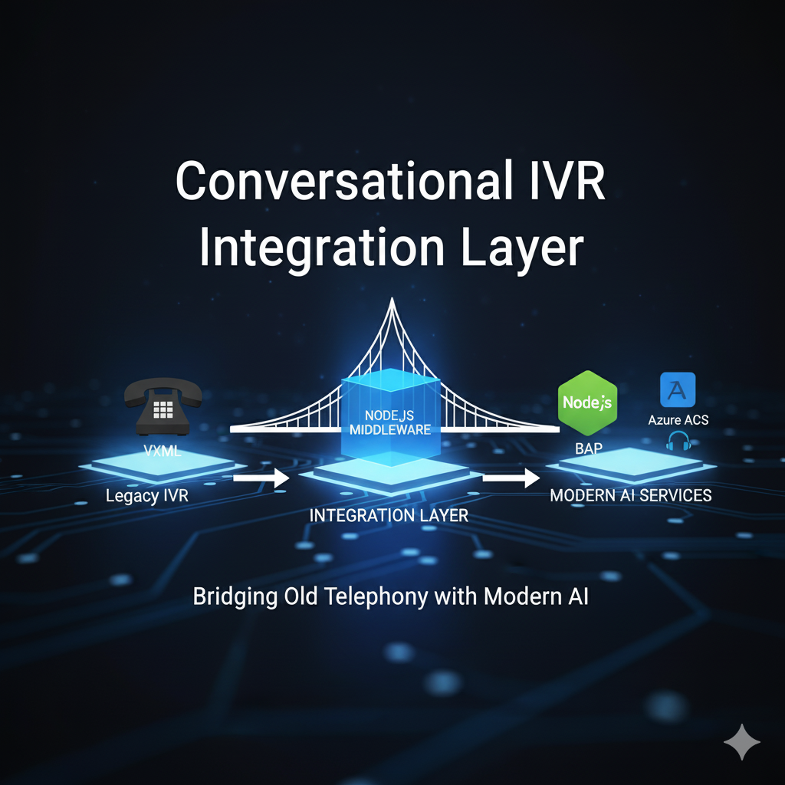
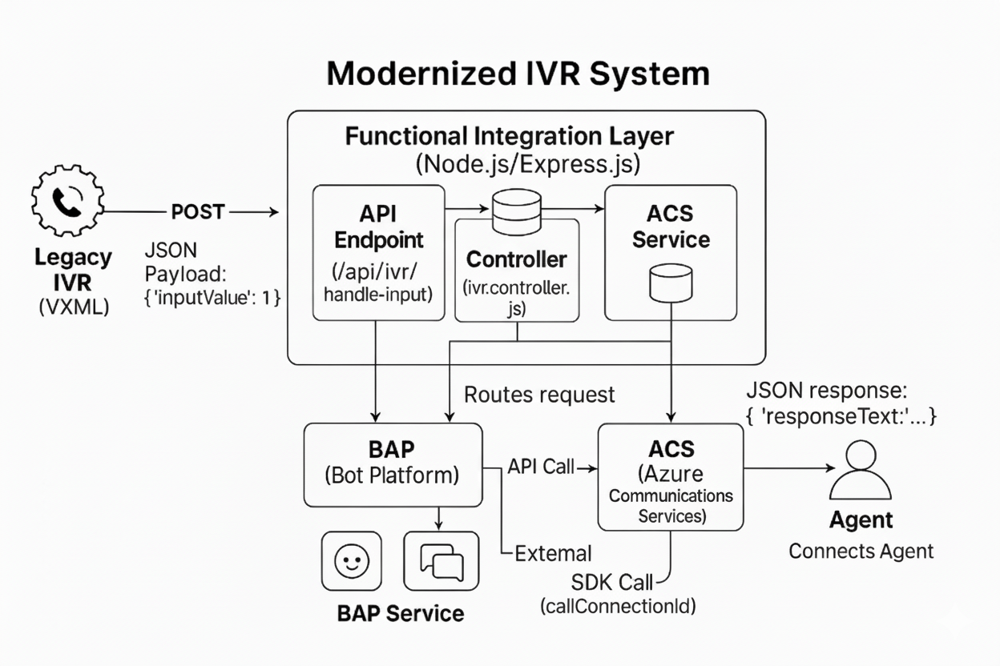
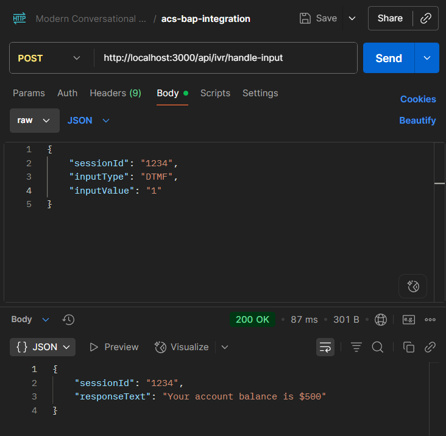
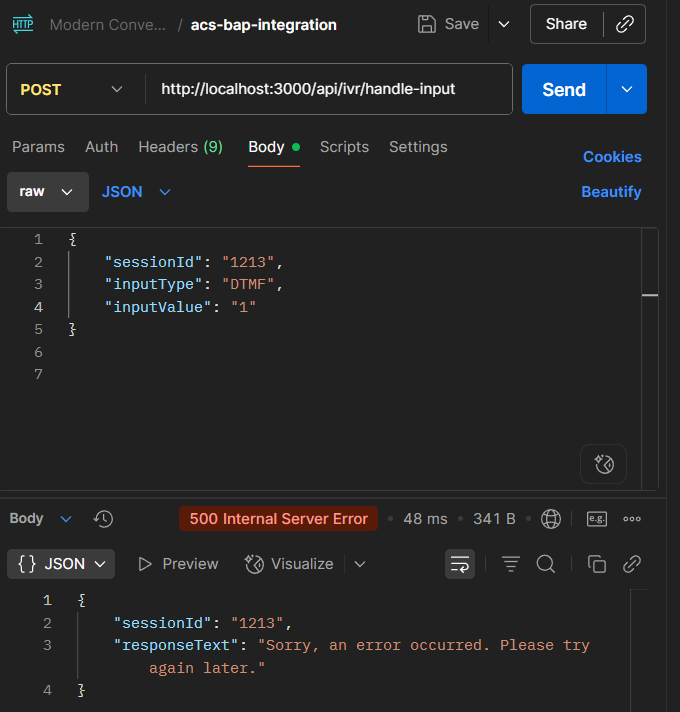
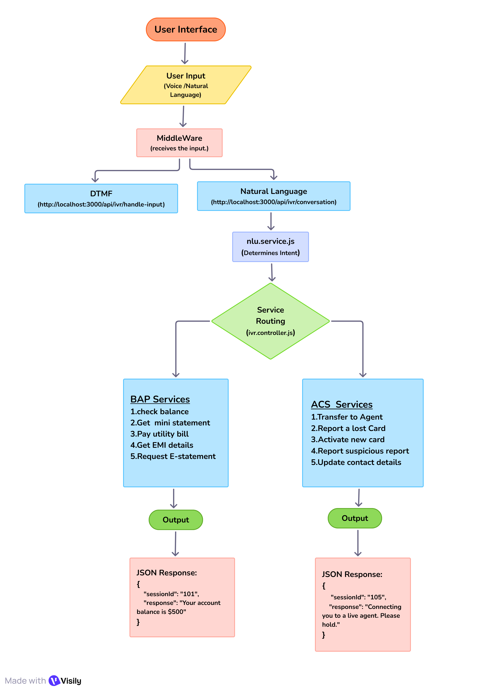

<p align="center">
  
</p>

<h1 align="center">IVR Modernization Middleware - Milestone 2</h1>

<p align="center">
  <strong>Name:</strong> Vinay <br>

</p>

---

## Introduction

This project modernizes a legacy VXML-based IVR (Interactive Voice Response) system by integrating it with advanced conversational AI platforms like Azure Communication Services (ACS) and Business Automation Platform (BAP).

**Milestone 2** focuses on developing and implementing a robust Node.js middleware. This integration layer routes IVR requests, simulates ACS/BAP integrations, and is structured for future expansion.

---

## System Architecture

The middleware acts as the central hub, decoupling the legacy IVR from backend services.



**Flow Overview:**

- **Legacy IVR** captures user keypress and sends it to **Middleware**
- **Middleware** controller analyzes input, routes to corresponding mock ACS or BAP service
- **Mock Services** simulate responses to user queries
- **Middleware** returns formatted response to IVR

---

## Folder Structure

The project is organized for clarity and modularity:

```
ivr-acs-bap-integration/
├── assets/
│   ├── 1.png                # Success case image (Valid input)
│   ├── 2.png                # (Deprecated, see below)
│   └── 3.png                # Error case image (Client-side failure)
├── docs/
│   ├── API.md               # API documentation
│   └── architecture.png     # System architecture diagram
├── node_modules/
├── src/
│   ├── api/
│   │   ├── controllers/
│   │   │   └── ivr.controller.js      # Core logic for handling IVR requests
│   │   ├── routes/
│   │   │   └── ivr.routes.js          # Defines the API endpoints
│   │   └── services/
│   │       ├── acs.service.js         # Simulates interaction with ACS
│   │       └── bap.service.js         # Simulates interaction with BAP bot
│   ├── config/
│   │   └── index.js                   # For managing environment variables
│   └── utils/
│       └── logger.js                  # For logging requests and errors
├── .env                               # Environment variables (e.g., port, API URLs)
├── .gitignore                         # Files to be ignored by Git
├── package.json
├── README.md                          # Project documentation (this file)
└── server.js                          # Express server entry point
```

---

## Setup and Installation

### Prerequisites

- [Node.js](https://nodejs.org/) (v16 or higher)
- [npm](https://www.npmjs.com/)
- REST client: [Thunder Client](https://www.thunderclient.com/) or Postman

### Installation Steps

1. **Install Dependencies**
   ```bash
   npm install
   ```
2. **Run the Server**
   ```bash
   npm start
   ```
   - Uses `nodemon` for automatic reloading (configured in `package.json`).

---

## API Endpoints

### Main Endpoint

- `POST /api/ivr/handle-input`  
  Receives a user's digit input from the IVR. Routes the request internally to mock ACS or BAP service.

### Mock Endpoints

- `POST /api/mock-bap-bot`  
  Dummy endpoint simulating BAP bot response for self-service queries.

---

## Sample Request/Response

**Request (from IVR to Middleware)**

```json
{
  "sessionId": "session-xyz-12345",
  "inputType": "DTMF",
  "inputValue": "1"
}
```

**Response (from Middleware to IVR)**

```json
{
  "sessionId": "session-xyz-12345",
  "responseText": "Your account balance is $500."
}
```

Endpoints were tested successfully using Thunder Client.

- **Success Case:** Valid input (`inputValue: "1"`)  
  When the user enters a valid input, the middleware navigates to the success page.  
  

- **Error Case:** Client-side failure  
  In case of a client-side error, the middleware navigates to the error page.  
  

---

## Documentation

- **API Reference:** See [`docs/API.md`](./docs/API.md) for complete endpoint details.
- **Architecture:** See [`docs/architecture.png`](./docs/architecture.png) for the system diagram.

---

## Task Division

**As the sole developer for this milestone:**

- **Server & Routing:** Set up Express server and API routes.
- **Controller Logic:** Implemented core request handling and routing.
- **Service Mocking:** Created simulated BAP and ACS services.
- **Documentation:** Authored README.md and API documentation.

---

## Challenges & Learnings

### Challenges

- Structuring Express application for scalability and modularity.
- Simulating asynchronous service calls using async/await to mimic real-world API interactions.

### Learnings

- **Middleware Power:** Middleware can bridge legacy and modern systems, enabling phased modernization.
- **Modular Architecture:** Separation of concerns (routes, controllers, services) leads to clean, maintainable code.

---

## Conclusion

Milestone 2 is complete. The Node.js middleware is fully functional, orchestrating workflows using mocked BAP and ACS services. It robustly handles user inputs and is structured for future integration.

**Next Steps:**  
Transition from mocked services to live ACS and BAP platforms, involving API credentials, SDKs, and real call data.

---

## Conversational AI Integration

This milestone successfully enhances the IVR integration layer by adding support for natural language (speech) inputs, making the system dual-channel.

- **New Conversational Endpoint**: A new endpoint, `/api/ivr/conversation`, was created to specifically handle speech-to-text queries.
- **Natural Language Understanding (NLU)**: A simple, keyword-based NLU service was developed to recognize user intent from plain text.
- **Expanded Service Capability**: All 10 existing services are now accessible via both traditional DTMF (keypress) and the new conversational flow.

---

## 2. Architectural Changes

The core architecture was extended to support a parallel conversational workflow. The integration layer now distinguishes between DTMF and speech inputs, processing the latter through a new NLU module before routing to the backend services.

---

## 3. New & Modified Components

### **New Component: NLU Service**

A new file, `nlu.service.js`, was created to act as the "brain" for understanding user speech.

- **Function**: It takes a text query, converts it to lowercase, and uses `includes()` to search for specific keywords (e.g., "balance", "agent", "statement").
- **Output**: It returns a specific `Intent` string (e.g., `CheckBalance`, `TalkToAgent`) that the controller uses for routing.

### **Modified Components**

- **`ivr.routes.js`**: A new route was added to direct conversational traffic.

  ```javascript
  // Milestone 3 Endpoint for Conversational (speech) inputs
  router.post("/conversation", ivrController.handleConversation);
  ```

- **`ivr.controller.js`**: A new handler function, `handleConversation`, was added. Its job is to:

  1.  Receive the text `query`.
  2.  Call the `nluService` to get the intent.
  3.  Use a `switch` statement to call the appropriate function from the BAP or ACS service based on the recognized intent.

- **`bap.service.js` & `acs.service.js`**: New functions (e.g., `getBalanceFromSpeech`) were added to handle requests originating from the conversational flow and provide natural language responses.

---

## 4. Conversational Workflow Explained

1.  **Speech to Text**: An external system (not part of this project) transcribes the user's spoken words into a text query.
2.  **API Request**: That system sends the text to the new endpoint: `POST /api/ivr/conversation`, with a JSON body like `{ "query": "I want to check my account balance" }`.
3.  **Intent Recognition**: The `handleConversation` function in the controller passes the query to the `nlu.service.js`. The service finds the keyword "balance" and returns the intent `CheckBalance`.
4.  **Service Routing**: The controller's `switch` statement matches the `CheckBalance` intent and calls the `getBalanceFromSpeech()` function in `bap.service.js`.
5.  **Response Generation**: The BAP service returns a JSON object with the appropriate response, e.g., `{ "response": "Your account balance is ₹500." }`.
6.  **Text to Speech**: The middleware sends this response back. The external system would then use a text-to-speech engine to play this message to the user.

### Conversational work flow diagram



## 5. Testing

The new endpoint was tested using Postman to simulate speech-to-text inputs.

### **Test Case: Get Mini Statement**

- **Endpoint**: `POST http://localhost:3000/api/ivr/conversation`
- **Request Body**:
  ```json
  {
    "sessionId": "101",
    "query": "Show me my recent transactions"
  }
  ```
- **Expected Response**:

  ```json
  {
    "sessionId": "101",
    "response": "Your last five transactions are: a debit of $50, a credit of $200, a debit of $25, a debit of $10, and a credit of $500."
  }
  ```

  ## 6. Challenges & Learnings

### **Challenges**

- **NLU Logic and Ambiguity**: My initial keyword-based NLU was too strict and faced challenges with ambiguous user queries. For example, a query for an "email statement" was incorrectly identified as a "mini statement" because both contain the word "statement". This required reordering the logic to check for the most specific intents first.
- **Maintaining Dual Functionality**: A key challenge was extending the application to support conversational flows without disrupting the existing, stable DTMF functionality from Milestone 2. This required careful additions to the routes, controller, and services.

### **Learnings**

- **The Importance of Rule Order in NLU**: I learned that in a keyword-based system, the order of rules is critical. More specific intents (like "email statement") must be evaluated before more general ones ("statement") to ensure accurate recognition.
- **Benefits of Modular Architecture**: This milestone truly demonstrated the power of the project's modular design. I was able to add a major new feature—natural language processing—by creating a new, self-contained `nlu.service.js` and adding a new controller function, without needing to refactor the core logic of Milestone 2.
- **API Design for Different Interaction Types**: I learned how to extend an API to support different types of user interaction by creating separate, dedicated endpoints (`/handle-input` for DTMF and `/conversation` for speech), which keeps the code clean and organized.

---

## 7. Conclusion

**Milestone 3 is successfully complete.** The integration layer has been significantly enhanced to support a dual-channel user experience, handling both traditional DTMF keypresses and natural language speech inputs. The system can now accurately recognize user intent for all 10 core services through a new conversational endpoint, laying a robust foundation for future integration with advanced AI platforms.

---

## Production Readiness & Quality Assurance

- **Objective** Final validation and production readiness of the modernized IVR system.

---

## 1. Key Accomplishments & Refactoring

This milestone focused on elevating the application from a functional prototype to a robust, production-ready service. The entire codebase was refactored to incorporate professional design patterns and ensure stability.

- **Validation Middleware**: Implemented a dedicated validation layer using `express-validator`. This moved all input validation (e.g., checking for missing fields) out of the controllers, resulting in cleaner and more focused business logic.
- **Centralized Error Handling**: A global error handler middleware was created to act as a single safety net for the entire application. It catches all server-side errors, logs them, and sends a consistent, user-friendly response, preventing application crashes and information leaks.
- **Code Cleanup and Standardization**:
  - Refactored the controllers to remove validation logic and pass all errors to the new centralized handler.
  - Standardized all API responses to a consistent JSON format (`{ sessionId, message }`) for both success and error cases, making the API more predictable.
- **Realistic Mock Services**: Enhanced the BAP and ACS services to handle more complex, sub-menu logic, better simulating a real-world production environment for thorough end-to-end testing.

---

## 2. Challenges & Learnings

### **Challenges**

- **Implementing Middleware Correctly**: Understanding the Express.js middleware chain was crucial. A key challenge was ensuring the validation middleware ran before the controller and that the error handling middleware was placed _last_ to correctly catch all preceding errors.
- **Refactoring Without Breaking Functionality**: Modifying the existing, working code to a more professional standard required careful planning to ensure that none of the 10 core services or dual-channel functionalities (DTMF and Conversational) were broken in the process.

### **Learnings**

- **The Power of Separation of Concerns**: This milestone was a practical lesson in professional software design. By separating validation and error handling from the core business logic, the code became significantly cleaner, easier to read, and more maintainable.
- **Building for Resilience**: I learned that a production application isn't just about handling the "happy path." A robust application must anticipate failures (invalid input, service outages) and handle them gracefully, which the new validation and error handling layers now achieve.
- **API Consistency is Key**: I learned that a well-designed API is a predictable one. Standardizing the response formats is a simple but powerful technique to make an API easier to consume and less prone to integration bugs.

---

## 3. Conclusion

**Milestone 4 is successfully complete.** The IVR(Interactive Voice Response) integration layer has been refactored into a robust, reliable, and professional-grade application. With the implementation of dedicated validation, centralized error handling, and consistent API responses, the middleware is now fully validated and architecturally sound, marking the successful conclusion of the development phase of this project. The system is now prepared for the final steps of deployment and integration with live production services.
